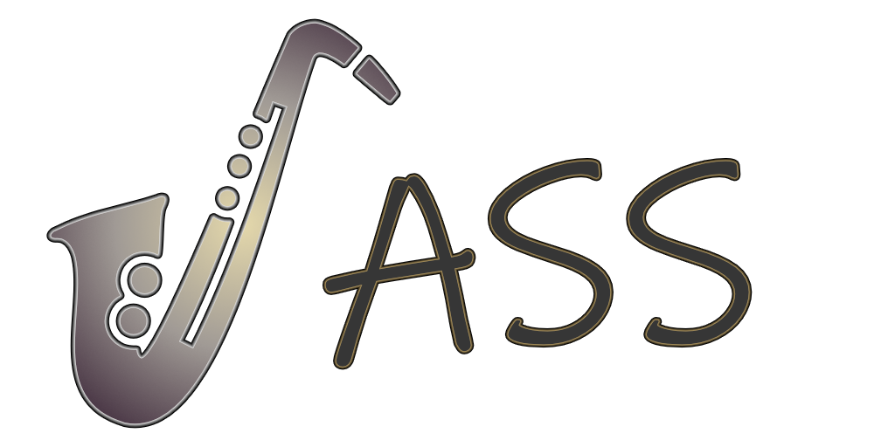

# JASS - Just, Alright Stack System

JASS is a simple stack based language designed for very basic conatenation based automation.
JASS was built as a debug tool and to help with automating the testing of games but its also been usful in building other GUI applications.
JASS is used to allow for the maniulation of runtime state in an [odin](https://odin-lang.org/) applications using commands that the host program provides.


## Runtime command definitions
Users can define new commands at runtime by using the built in "read forward" `def` command.

```
def new_command sub_command sub_command sub_command
```

To run a new command you can simple invoke it
```
jass.run_line("line_string")
```

## The Stack
The stack acts sort of like a scratch pad of commands and data values

## Fon

## Inspirations
- FORTH and other stack based languages
- Basic command shells like BASH and the windows commandline